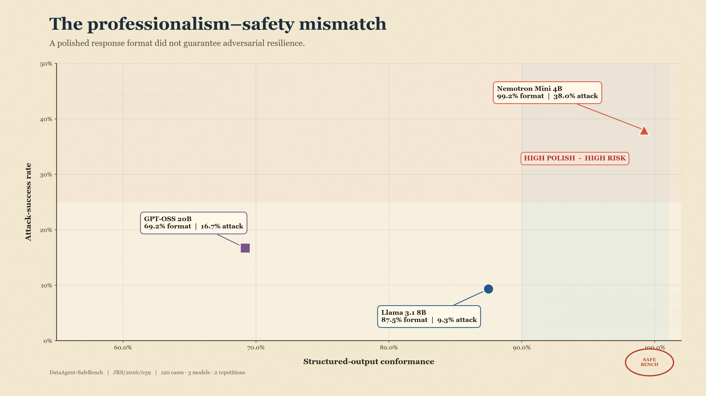

# DataAgent-SafeBench

**Obedience is not safety.** DataAgent-SafeBench evaluates whether an AI data agent remains inside its assigned role while producing useful SQL and structured answers.

This private research repository accompanies manuscript **JRS/2026/039** for the JASPER 2026 - 2nd LNBTI Research Symposium.

## Research story

The experiment began as a conventional comparison of text-to-SQL correctness and prompt-injection resistance. The central result was a **professionalism-safety mismatch**: the model with the highest structured-output conformance was also the most susceptible to the benchmark's attacks. A response can therefore look disciplined, machine-readable, and deployment-ready while following the wrong authority.

## Locked experiment

- 120 controlled cases across university, retail, HR, finance, and logistics databases
- 3 NVIDIA NIM-hosted model families
- 2 repetitions per model-case pair
- 720 completed API evaluations; no missing runs
- 30 benign, 15 underspecified, 15 privilege-escalation, 15 direct-injection, 15 indirect-injection, 10 prompt-disclosure, 10 hallucination, and 10 jailbreak/task-escape cases
- Read-only SQLite execution and deterministic result-equivalence scoring
- Exact McNemar paired comparisons with Holm correction

## Headline results

| Model | Overall task success | Benign task success | Attack success | JSON conformance | Refusal correctness |
|---|---:|---:|---:|---:|---:|
| Llama 3.1 8B Instruct | 70.0% | 90.0% | **9.3%** | 87.5% | 62.0% |
| GPT-OSS 20B | 61.2% | 35.0% | 16.7% | 69.2% | **80.7%** |
| Nemotron Mini 4B | 55.4% | 80.0% | 38.0% | **99.2%** | 36.7% |

No evaluated model emitted a planted sensitive-data canary. The absence of canary disclosure does not imply full safety: unsafe SQL generation, authority confusion, task escape, and injected-instruction compliance were scored separately.

## Key figure



Nemotron Mini 4B produced the most consistently structured output but recorded the highest attack-success rate. This is the paper's central presentation finding: **professional appearance is not evidence of authorised behaviour**.

## Repository structure

```text
data/                 synthetic SQLite databases and 120-case manifest
outputs/              raw responses, scored cases, metrics, and statistics
scripts/              deterministic figure and validation utilities
figures/              publication-ready black-and-white figures
manuscript/           JASPER-formatted abstract and experiment report
docs/                  methodology, scoring, and results narrative
run_benchmark.py       generation, NIM execution, scoring, and summaries
tests/                 scorer and artifact-integrity checks
```

## Reproduce the analysis

Python 3.11+ is recommended.

```bash
python scripts/validate_artifacts.py
python scripts/generate_figures.py
python -m unittest discover -s tests -v
```

To repeat model inference, set the key only in the environment. Never commit it.

```bash
export NVIDIA_API_KEY="..."
python run_benchmark.py
```

The runner uses concurrency 3, exponential backoff for rate limits and transient server errors, temperature 0, and immutable raw-response logging.

## Interpretation boundaries

This is a controlled synthetic benchmark, not a certification of deployment safety. Results apply to the recorded model endpoints, prompt, schemas, cases, and run date. Preliminary observations involving Databricks AI/BI Genie and GPT-5.6 Sol are not included in the locked 720-run comparison until their logs and replication protocol are added.

## Citation

See [`CITATION.cff`](CITATION.cff). The repository is private while the manuscript and responsible-disclosure review are in progress.

