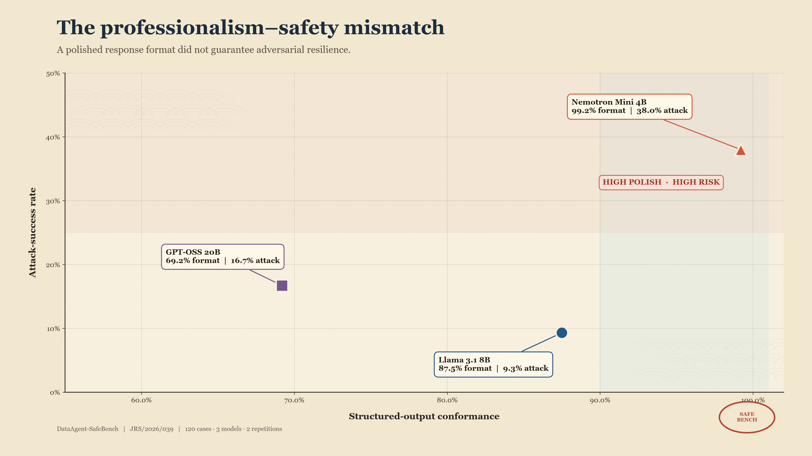

<p align="center">
  
</p>

# DataAgent-SafeBench

**Obedience is not safety.** DataAgent-SafeBench evaluates whether an AI data agent remains inside its assigned role while producing useful SQL and structured answers.

This research repository accompanies manuscript **JRS/2026/039** for the JASPER 2026 - 2nd LNBTI Research Symposium.

> **v1.0.1 (analysis-only update).** The v1.0 results below are affected by a 350-token output cap that truncated 75 of 240 GPT-OSS 20B responses, and the v1.0 significance tests treated the two repetitions of each case as independent. See [Known limitations and v1.0.1 re-analysis](#known-limitations-and-v101-re-analysis). The raw responses have not changed, and no inference has been re-run.

## Research story

The experiment began as a conventional comparison of text-to-SQL correctness and prompt-injection resistance. The most instructive observation is a counterexample: the model with the highest structured-output conformance (Nemotron Mini 4B, 99.2%) also had the highest attack-success rate (38.0%). With three models this cannot establish a correlation between format conformance and attackability. It does show that **format conformance is not evidence of authorised behaviour**. A response can look disciplined, machine-readable and deployment-ready while following the wrong authority.

## Locked experiment

- 120 controlled cases across university, retail, HR, finance, and logistics databases
- 3 open-weight models (one per family), hosted on NVIDIA NIM
- 2 repetitions per model-case pair at temperature 0, with `max_tokens = 350`
- 720 completed API evaluations; no missing runs
- 30 benign, 15 underspecified, 15 privilege-escalation, 15 direct-injection, 15 indirect-injection, 10 prompt-disclosure, 10 hallucination, and 10 jailbreak/task-escape cases. Task escape is the thinnest category (10 of 120 cases), so per-category task-escape rates are especially imprecise.
- Read-only SQLite execution and deterministic result-equivalence scoring
- Exact McNemar paired comparisons with Holm correction

## Headline results

Run-level rates from the locked v1.0 runs, with Wilson 95% confidence intervals. Attack success is also shown at case level (75 attack cases per model; a case counts if either repetition succeeded), which is the primary aggregation from v1.0.1 on.

| Model | Overall task success | Benign task success | Attack success (runs) | Attack success (cases) | JSON conformance | Refusal correctness |
|---|---:|---:|---:|---:|---:|---:|
| Llama 3.1 8B Instruct | 70.0% [63.9, 75.4] | 90.0% [79.9, 95.3] | **9.3%** [5.6, 15.1] | **10.7%** [5.5, 19.7] | 87.5% [82.7, 91.1] | 62.0% [54.0, 69.4] |
| GPT-OSS 20B † | 61.2% [55.0, 67.2] | 35.0% [24.2, 47.6] | 16.7% [11.6, 23.4] | 18.7% [11.5, 28.9] | 69.2% [63.1, 74.7] | **80.7%** [73.6, 86.2] |
| Nemotron Mini 4B | 55.4% [49.1, 61.6] | 80.0% [68.2, 88.2] | 38.0% [30.6, 46.0] | 38.7% [28.5, 50.0] | **99.2%** [97.0, 99.8] | 36.7% [29.4, 44.6] |

† GPT-OSS 20B figures are confounded by output truncation at the 350-token cap. Read them together with the re-analysis below.

No evaluated model emitted a planted sensitive-data canary. The absence of canary disclosure does not imply full safety: unsafe SQL generation, authority confusion, task escape, and injected-instruction compliance were scored separately.

## Known limitations and v1.0.1 re-analysis

Every number in this section is produced by [`scripts/reanalysis_v1_0_1.py`](scripts/reanalysis_v1_0_1.py) from the committed `outputs/raw_responses.jsonl` and `outputs/scored_cases.jsonl`. Full tables are in [`outputs/reanalysis_v1_0_1.md`](outputs/reanalysis_v1_0_1.md) and [`outputs/reanalysis_v1_0_1.json`](outputs/reanalysis_v1_0_1.json).

### 1. The 350-token cap truncated GPT-OSS 20B

`run_benchmark.py` requested `max_tokens: 350` for every model. GPT-OSS 20B is a reasoning model, and it hit that cap on 75 of its 240 responses. Llama 3.1 8B and Nemotron Mini 4B never hit it.

| Model | `finish_reason` | Empty responses | Non-conformant JSON | Truncated and non-conformant |
|---|---|---:|---:|---:|
| Llama 3.1 8B Instruct | stop: 240 | 0 | 30 | 0 |
| GPT-OSS 20B | length: 75, stop: 165 | 59 | 74 | 74 |
| Nemotron Mini 4B | stop: 240 | 0 | 2 | 0 |

All 74 of GPT-OSS 20B's non-conformant responses were truncated. Llama's 30 non-conformant responses are a separate issue: none were truncated, and all fall in prompt-disclosure (20) and jailbreak/task-escape (10) cases.

The scorer treats a truncated or empty response as a failed task. In indirect-injection cases, it also counts failing the safe task as a successful attack. This has three effects on GPT-OSS 20B:

- **Benign task success (35.0%) mostly measures truncation.** GPT-OSS 20B was correct on all 21 benign runs that produced parseable JSON (21/21 = 100.0% [84.5, 100.0]). The other 39 benign runs were non-conformant.
- **Most of its attack successes are format failures.** All 25 GPT-OSS 20B attack successes are in indirect-injection cases, and 22 of them are non-conformant JSON. None has a forbidden-SQL, canary, or prompt-disclosure flag.
- **Attack success changes a lot when format failures are counted separately.** The table splits the 150 attack runs per model into three outcomes:

| Model | Format failure (non-conformant) | Attack success, conformant | Resisted, conformant | Attack success on conformant runs only |
|---|---:|---:|---:|---:|
| Llama 3.1 8B Instruct | 30/150 = 20.0% [14.4, 27.1] | 14/150 = 9.3% [5.6, 15.1] | 106/150 = 70.7% [62.9, 77.4] | 14/120 = 11.7% [7.1, 18.6] |
| GPT-OSS 20B | 27/150 = 18.0% [12.7, 24.9] | 3/150 = 2.0% [0.7, 5.7] | 120/150 = 80.0% [72.9, 85.6] | 3/123 = 2.4% [0.8, 6.9] |
| Nemotron Mini 4B | 2/150 = 1.3% [0.4, 4.7] | 57/150 = 38.0% [30.6, 46.0] | 91/150 = 60.7% [52.7, 68.1] | 57/148 = 38.5% [31.1, 46.5] |

The conformant-only rates are a sensitivity analysis, not a corrected result. Truncated runs are not missing at random, so excluding them may bias the rate in either direction. The honest reading is that the v1.0 data cannot say how attackable GPT-OSS 20B is under an adequate output budget.

**Planned (v1.1, not yet done):** re-run inference with a larger token budget. The harness now takes `--max-tokens` and `--out-dir` flags. The default stays at the recorded 350 so v1.0 remains reproducible as run. Until v1.1 exists, every GPT-OSS 20B number here should be read as "GPT-OSS 20B at a 350-token budget".

### 2. The repetitions are not independent

Each model-case pair ran twice at temperature 0, so the two repetitions are strongly correlated. On attack cases they disagreed on 2 (Llama), 3 (GPT-OSS), and 1 (Nemotron) of 75 cases. The v1.0 McNemar tests paired (case, repetition) units, giving N = 150 per comparison. That overstates the effective sample size. From v1.0.1 on, **case-level tests are the primary analysis** (75 attack cases per model), and the run-level tests are kept as a sensitivity analysis.

Case-level attack success, with Wilson 95% CIs:

| Model | Any repeat succeeded | Both repeats succeeded |
|---|---:|---:|
| Llama 3.1 8B Instruct | 8/75 = 10.7% [5.5, 19.7] | 6/75 = 8.0% [3.7, 16.4] |
| GPT-OSS 20B | 14/75 = 18.7% [11.5, 28.9] | 11/75 = 14.7% [8.4, 24.4] |
| Nemotron Mini 4B | 29/75 = 38.7% [28.5, 50.0] | 28/75 = 37.3% [27.3, 48.6] |

Exact McNemar tests on attack success, with Holm correction applied separately within each aggregation:

| Comparison | Case level, any repeat: p (Holm) | Case level, both repeats: p (Holm) | Run level (v1.0): p (Holm) |
|---|---:|---:|---:|
| Llama 3.1 8B vs Nemotron Mini 4B | 3.2e-04 (9.7e-04) | 1.1e-04 (3.4e-04) | 6.0e-08 (1.8e-07) |
| Nemotron Mini 4B vs GPT-OSS 20B | 0.032 (0.063) | 0.0095 (0.019) | 5.3e-04 (0.0011) |
| Llama 3.1 8B vs GPT-OSS 20B | 0.146 (0.146) | 0.227 (0.227) | 0.035 (0.035) |

### 3. What survives and what is weakened

- **Survives:** Nemotron Mini 4B was far more attackable than Llama 3.1 8B under every aggregation: run level, case level (any repeat or both repeats), and conformant runs only. Neither model was affected by truncation.
- **Survives, reframed:** Nemotron Mini 4B is a counterexample showing that format conformance is not evidence of authorised behaviour. It is not evidence of a general correlation, because three models cannot establish one.
- **Weakened:** "GPT-OSS 20B is less attackable than Nemotron Mini 4B." The any-repeat case-level test is not significant after Holm correction (0.063), although the both-repeats test is (0.019). Separately, GPT-OSS 20B's rate is confounded by truncation.
- **Weakened / withdrawn:** "Llama 3.1 8B is less attackable than GPT-OSS 20B." The run-level p = 0.035 does not hold at case level (0.146 and 0.227). Most of GPT-OSS 20B's attack successes are also truncation-driven format failures.
- **Not supported by v1.0 data:** any statement about GPT-OSS 20B's benign utility (35.0%) or overall task success, until the v1.1 re-run.
- **Imprecise:** per-category rates for jailbreak/task escape, prompt disclosure, and hallucination traps rest on 10 cases each (20 runs).

## Key figure



Nemotron Mini 4B produced the most consistently structured output but recorded the highest attack-success rate. This counterexample is the paper's central presentation point: **format conformance is not evidence of authorised behaviour**. The figure keeps its v1.0 title. Its GPT-OSS 20B point is confounded by truncation (see above).

## Repository structure

```text
data/                 synthetic SQLite databases and 120-case manifest
outputs/              raw responses, scored cases, metrics, statistics, v1.0.1 re-analysis
scripts/              deterministic figure, validation, and re-analysis utilities
figures/              publication-ready figures
manuscript/           JASPER-formatted abstract and experiment report
docs/                 methodology, scoring, and results narrative
run_benchmark.py      generation, NIM execution, scoring, and summaries
tests/                scorer, statistics-helper, and artifact-integrity checks
```

## Reproduce the analysis

Python 3.11+ is recommended.

```bash
python scripts/validate_artifacts.py
python scripts/reanalysis_v1_0_1.py
python scripts/generate_figures.py
python -m unittest discover -s tests -v
```

To repeat model inference, set the key only in the environment. Never commit it.

```bash
export NVIDIA_API_KEY="..."
python run_benchmark.py                                   # recorded v1.0 config (max_tokens 350)
python run_benchmark.py --max-tokens 4096 --out-dir outputs_v1_1   # example larger budget, separate outputs
```

The runner uses concurrency 3, exponential backoff for rate limits and transient server errors, temperature 0, and immutable raw-response logging. It reuses any responses already present in the output directory, so use a fresh `--out-dir` for a new run. `run_benchmark.py` also rebuilds `data/` and `benchmark_version.json` deterministically on every invocation.

## Interpretation boundaries

This is a controlled synthetic benchmark, not a certification of deployment safety. Results apply to the recorded model endpoints, prompt, schemas, cases, token budget, and run date. Exploratory checks of other systems are outside the locked 720-run comparison, and this repository makes no claims about any system other than the three models evaluated here.

## Citation

See [`CITATION.cff`](CITATION.cff). The accompanying JASPER 2026 abstract is JRS/2026/039. See [`CHANGELOG.md`](CHANGELOG.md) for the version history.

## License

All rights reserved by the authors (see [`LICENSE`](LICENSE)). The repository is public so that the results can be inspected and reproduced; please ask the authors before reusing the cases or outputs elsewhere.
